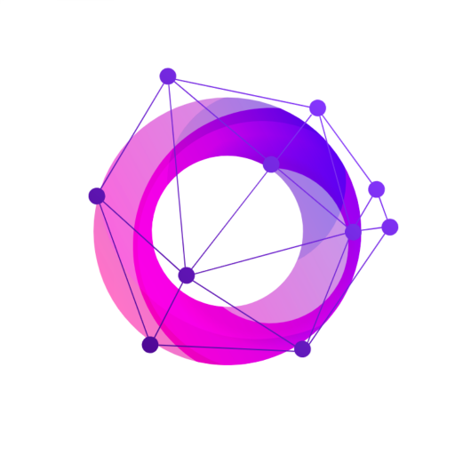
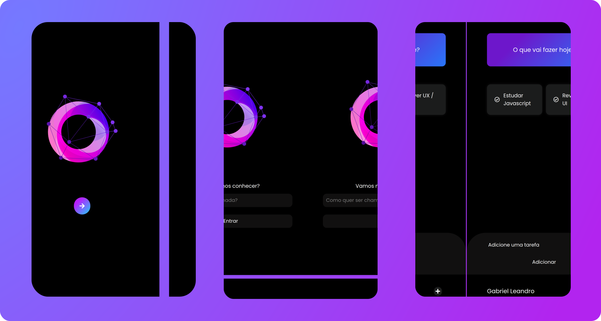

<h1 align="center">
    
</h1>

  <a href="#rocket-tecnologias">Tecnologias</a>&nbsp;&nbsp;&nbsp;|&nbsp;&nbsp;&nbsp;
  <a href="#-projeto">Projeto</a>&nbsp;&nbsp;&nbsp;|&nbsp;&nbsp;&nbsp;
  <a href="#-layout">Layout</a>&nbsp;&nbsp;&nbsp;|&nbsp;&nbsp;&nbsp;
  <a href="#memo-licença">Licença</a>

 

## 🚀 Tecnologias

Esse projeto foi desenvolvido utilizando tecnologias consideradas ultrapassadas, são elas:

- [AngularJs](https://angularjs.org/)
- [Jquery](https://jquery.com/)

## 💻 Projeto

O Add This é um projeto projeto pessoal que tem o objetivo de adquirir conhecimento e obter experiência nessa determinada tecnologia. 💜

## 🔖 Layout

O layout desenvolvido visou um design minimalista mas ao mesmo tempo impactante.

    

## 📝 Licença

Esse projeto está sob a licença MIT. Veja o arquivo [LICENSE](LICENSE.md) para mais detalhes.

---

Desenvolvido por Gabriel Leandro 💜

